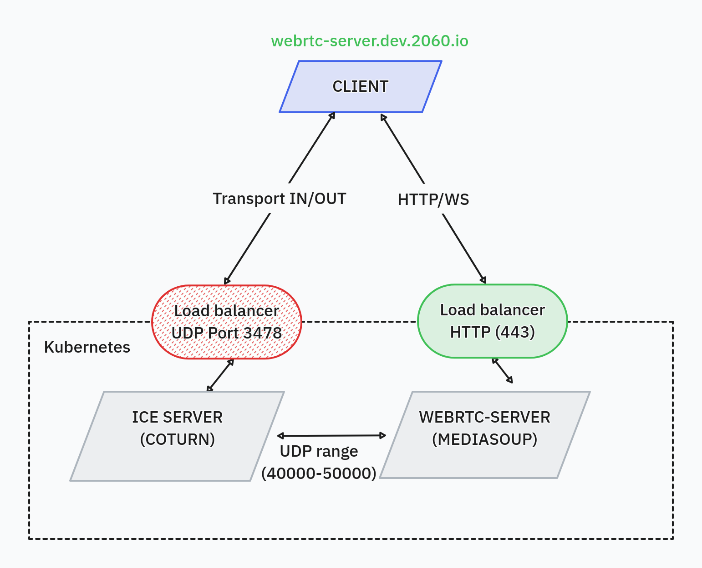

# WebRTC Server with Mediasoup, Docker, Kubernetes and Turn Server

This application, based on [Mediasoup-demo v3](https://github.com/versatica/mediasoup-demo/tree/v3), has been extensively modified and customized for 2060 to include a TURN server, specifically Coturn.

You can deploy it using Docker or Kubernetes, with integration of the [Coturn](https://github.com/coturn/coturn) server for TURN functionality.

## Table of Contents

- [WebRTC Server with Mediasoup, Docker, Kubernetes and Turn Server](#webrtc-server-with-mediasoup-docker-kubernetes-and-turn-server)
  - [Table of Contents](#table-of-contents)
  - [Pre-requisites](#pre-requisites)
  - [Environment Variables](#environment-variables)
  - [Diagram of solution webrtc-server](#diagram-of-solution-webrtc-server)
  - [Changing the TCP Port (Web App and WSS)](#changing-the-tcp-port-web-app-and-wss)
  - [Docker build](#docker-build)
  - [Docker Running](#docker-running)
  - [Kubernetes Running](#kubernetes-running)
  - [WebRTC Server API](#webrtc-server-api)
    - [GetRoomId](#get-room-id)
    - [Create Rooms](#create-rooms)
    - [Config](#config)
    - [Other Server Mediasoup Endpoints](#other-server-mediasoup-endpoints)
  - [ICE Server Configuration](#ice-server-configuration)

## Pre-requisites

- A Linux server with a public IP address (or an EIP on AWS)
- Docker and Docker Compose, for local deployment
- A TURN server, with port 3478 forwarded from the public IP (configured within Docker)
- A Mediasoup server running in a container with port 443 forwarded from the public IP (this is configured in docker)

## Enviroment Variables

To configure and build the `ICE Server` you can be use following enviroment variables:

| Variable                            | Description                                     | Default Value |
| ----------------------------------- | ----------------------------------------------- | ------------- |
| `MEDIASOUP_CLIENT_PROTOOPORT`       | Port used for the connection.                   | `443`         |
| `MEDIASOUP_CLIENT_ENABLE_ICESERVER` | Enable ICE server mode.                         | `yes`         |
| `MEDIASOUP_CLIENT_ICESERVER_PROTO`  | Protocol configuration used (e.g., `udp`).      | `udp`         |
| `MEDIASOUP_CLIENT_ICESERVER_PORT`   | Port set in the TURN server to receive traffic. | `3478`        |
| `MEDIASOUP_CLIENT_ICESERVER_USER`   | Username for the TURN server.                   |               |
| `MEDIASOUP_CLIENT_ICESERVER_PASS`   | Password for the TURN server.                   |               |
| `MEDIASOUP_CLIENT_ICESERVER_HOST`   | Public IP address of the TURN server.           |               |

Additional variables for configuring the `webrtc-server`:

| Variable                 | Description                                                    | Default Value                       |
| ------------------------ | -------------------------------------------------------------- | ----------------------------------- |
| `PROTOO_LISTEN_PORT`     | Port for the protoo WebSocket server and HTTP API server.      | `4443`                              |
| `HTTPS_CERT_FULLCHAIN`   | Path to the fullchain certificate file for HTTPS.              | `<project_dir>/certs/fullchain.pem` |
| `HTTPS_CERT_PRIVKEY`     | Path to the private key file for HTTPS.                        | `<project_dir>/certs/privkey.pem`   |
| `MEDIASOUP_INGRESS_HOST` | Ingress host for the mediasoup client.                         |                                     |
| `MEDIASOUP_MIN_PORT`     | Minimum port for RTC connections in mediasoup.                 | `40000`                             |
| `MEDIASOUP_MAX_PORT`     | Maximum port for RTC connections in mediasoup.                 | `49999`                             |
| `MEDIASOUP_LISTEN_IP`    | IP address for mediasoup WebRTC server to listen on.           | `0.0.0.0` or `127.0.0.1`            |
| `MEDIASOUP_ANNOUNCED_IP` | Public IP address to be announced for mediasoup WebRTC server. |                                     |
| `MEDIASOUP_INGRESS_HOST` | Set Ingress host for /getRoomId response                       |                                     |

## Diagram of solution webrtc-server



## Changing the TCP Port (Web App and WSS)

`Server`, The port is configured in `server/config.js` with `PROTOO_LISTEN_PORT`.

```
git clone https://github.com/2060-io/webrtc-server.git
vi docker-compose.yml
services:
  mediasoup:
    image: webrtc-server:test
    environment:
      PROTOO_LISTEN_PORT: 443
    ports:
      - '443:443'
```

:exclamation: if you change this you have to rebuild the Docker image

## Docker build

- Clone the repo
- Run docker build in the server folder

```
git clone https://github.com/2060-io/webrtc-server.git
docker build . -t 2060-webrtc-server:test
```

Should the start.sh script fail to detect the container's IP address, you may modify the Dockerfile by replacing CMD ["sh", "/service/start.sh"] with CMD ["node", "/service/server.js"]. Subsequently, manually set the MEDIASOUP_ANNOUNCED_IP variable.

You are required to generate a certificate and place both its public and private part in PEM format in a directory reachable by the application. The full path must be set on `HTTPS_CERT_FULLCHAIN` and `HTTPS_CERT_PRIVKEY` environment variable respectively.

Certificate can be created using OpenSSL with the execution of the following commands:

```bash
openssl genpkey -algorithm RSA -out privkey.pem
openssl req -new -key privkey.pem -out request.csr
openssl x509 -req -in request.csr -signkey privkey.pem -out fullchain.pem
```

## Docker Running

Edit `docker-compose.yml` to update environment variables and Docker image settings for mediasoup with your own (otherwise it will use my turn server and it will not work)

```bash
docker-compose up
```

## Kubernetes Running

**`IMPORTANT`**, Ensure the Kubernetes load balancer allows UDP traffic to the Coturn service nodes. Set the public IP in the `.env` file as `MEDIASOUP_CLIENT_ICESERVER_HOST` enviroment variable.

## WebRTC Server API

### GetRoomId

This endpoint was added to the WebRTC server to generate the roomId and the websocket connection that the mobile application will use for communication. **This endpoint has been Deprecated**

Set the mandatory variable MEDIASOUP_INGRESS_HOST with the application's ingress to be used by the endpoint to form the connection wsUrl.

```
MEDIASOUP_INGRESS_HOST='localhost'
```

#### Request

- Method: GET
- Endpoint: `/getRoomId`
- Port: 443

#### Response

- Status Code: 200 (OK)
- Body:

```json
{
  "roomId": "8c6ljcfc",
  "wsUrl": "wss://localhost:443?roomId=8c6ljcfc&peerId=",
  "status": 1
}
```

### Create Rooms 

This endpoint is used to create a new room or use an existing room based on the provided or generated `roomId`. It returns the WebSocket URL and the `roomId` used, and checks for unique room identifiers before proceeding.

#### Request

- Method: POST
- Endpoint: `/rooms/:roomId?`
- Port: 443
- Body:

```json
{
  "eventNotificationUri": "http://example.com/notification",
  "maxPeerCount": 50
}
```

#### Response

- Status Code: 200 (OK)
- Body:

```json
{
  "roomId": "12345abcde",
  "wsUrl": "wss://localhost:443?roomId=12345abcde"
}
```
#### Error

- Status Code: 500 (Internal Server Error)
- Body:

```json
{
  "error": "Room with roomId 12345abcde already exists."
}
```

### Config

Provides the current configuration of the server as defined in the `config.js` file.

#### Request

- Method: GET
- Endpoint: `/config`
- Port: 443

#### Response

- Status Code: 200 (OK)
- Body example:

```json
{
  "config": {
    "https": {
      "listenPort": 443,
      "listenIp": "localhost",
      "tls": {
        "cert": "/path/to/cert.pem",
        "key": "/path/to/key.pem"
      }
    }
  }
}
```

### Other Server Mediasoup Endpoints

Comprehensive endpoints for various functionalities:

- `/rooms/:roomId`: `GET`Returns the RTP capabilities of the mediasoup router for a specific room.
- `/rooms/:roomId/broadcasters`: `POST` Creates a new broadcaster in a specific room.
- `/rooms/:roomId/broadcasters/:broadcasterId`: `DELETE` Deletes a broadcaster from a specific room.
- `/rooms/:roomId/broadcasters/:broadcasterId/transports`: `POST` Creates a new transport associated with a broadcaster.
- `/rooms/:roomId/broadcasters/:broadcasterId/transports/:transportId/connect`: `POST` Connects a transport belonging to a broadcaster.
- `/rooms/:roomId/broadcasters/:broadcasterId/transports/:transportId/producers`: `POST` Creates a new producer associated with a broadcaster.
- `/rooms/:roomId/broadcasters/:broadcasterId/transports/:transportId/consume`: `POST` Creates a new consumer associated with a broadcaster.
- `/rooms/:roomId/broadcasters/:broadcasterId/transports/:transportId/consume/data`: `POST` Creates a new data consumer associated with a broadcaster.
- `/rooms/:roomId/broadcasters/:broadcasterId/transports/:transportId/produce/data`: `POST` Creates a new data producer associated with a broadcaster.

## ICE Server Configuration

Retrieve ICE Server settings via a peer websocket request to create a WebRTC Transport `createWebRtcTransport`:

```json
{
  "iceServer": {
    "enableIceServer": "yes",
    "iceServerHost": "localhost",
    "iceServerProto": "udp",
    "iceServerPort": "3478",
    "iceServerUser": "test",
    "iceServerPass": "test123"
  }
}
```
