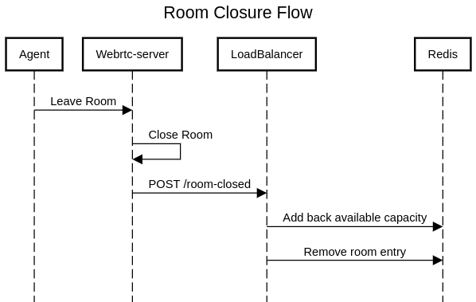

# Load Balancer for WebRTC Mediasoup Servers

## Overview

This project implements a **load balancer** for WebRTC **Mediasoup** servers. It enables **automatic server registration**, **health monitoring**, and **dynamic load balancing** to efficiently distribute WebRTC rooms among the available servers, ensuring a scalable and robust architecture.

---

## **Key Features**

### **Server Registration**

- **Dynamic server registration**: Servers register themselves dynamically when they start up.
- **Duplicate prevention**: If a server is already registered, the previous entry is removed and updated.
- **Capacity calculation**: Each server's **total capacity** is computed based on the number of workers (`workers × 500 consumers`).
- **Storage in Redis**: All registered servers are stored in Redis for fast retrieval.

### **Health Monitoring & Auto-Removal**

- **Scheduled health checks**: A background process continuously monitors all registered servers.
- **HTTP-based ping test**: Each server is periodically tested via an HTTP `GET` request to the `/health` endpoint.
- **Automatic deactivation**: If a server is unresponsive or returns a non-200 status code, it is marked as **unhealthy (`health: false`)**.
- **Reactivation**: If a previously unhealthy server becomes responsive, it is marked as **healthy (`health: true`)**.

### **Room Allocation & Load Balancing**

- **Load-aware room allocation**: When creating a room, the load balancer selects the server with the **highest available capacity**.
- **Capacity tracking**: Each time a room is created, the number of **expected consumers** is subtracted from the server’s capacity.
- **Room deallocation**: When a room is closed, the consumers are freed, and the server’s available capacity is restored.

### **Fault Tolerance & Scalability**

- **Multi-instance support**: The system can be deployed in a **distributed** environment with multiple load balancer instances.
- **Event-driven updates**: Server states and capacity updates are immediately reflected across all instances via Redis.
- **Automatic failover**: If a WebRTC server becomes unavailable, new rooms are assigned only to healthy servers.

---

## **Architecture & Implementation**

### **1. Server Registration Flow**

1. A Mediasoup server sends a `POST /register` request.
2. If the server is already registered, its entry is removed and re-added.
3. The server’s total capacity is calculated (`workers × 500` consumers).
4. The server is stored in Redis with `health: true`.


### **2. Health Check Process**

1. Every **30 seconds** (or as defined in `HEALTH_CHECK_INTERVAL`), the system checks all registered servers.
2. A `GET /health` request is sent to each server.
3. If the server is **healthy**, its `health` status remains `true`.
4. If the server is **unhealthy**, its `health` status is updated to `false`.


### **3. Room Allocation Flow**

1. A client requests to **create a room** (`POST rooms/:roomId?`).
2. The load balancer filters out **unhealthy servers**.
3. The server with the **highest available capacity** is selected.
4. The expected consumers for the room are **subtracted** from the server’s capacity.
5. The room is created, and the WebSocket URL is returned.


### **4. Room Closure Flow**

1. When a room is **closed** within the WebRTC server and the load balancer mode is active, the server sends a `POST /room-closed` notification (webhook) to the load balancer, informing that the roomId has been closed.
2. The number of consumers freed is **added back** to the server’s available capacity.
3. The room entry is **deleted** from Redis.



---

## **Endpoints**

### **Register a WebRTC Server**

Registers a new Mediasoup server, calculating its total capacity.

**`POST /register`**

#### 🔹 Request Body:

```json
{
  "serverId": "server-001",
  "serviceUrl": "http://example.com",
  "workers": 4
}
```

#### 🔹 Response:

```json
{ "message": "Server registered successfully" }
```

---

### **Create Room**

Selects the most capable healthy server and assigns the room.

**`POST rooms/:roomId?`**

#### 🔹 Request Body:

```json
{
  "eventNotificationUri": "http://example.com/notify",
  "maxPeerCount": 3
}
```

#### 🔹 Response:

```json
{
  "protocol": "2060-mediasoup-v1",
  "wsUrl": "wss://example.com:443",
  "roomId": "room-67890"
}
```

---

### **Notify Room Closure**

Updates the server's available capacity when a room is closed.

**`POST /room-closed`**

#### 🔹 Request Body:

```json
{
  "serverId": "server-001",
  "roomId": "room-67890"
}
```

#### 🔹 Response:

```json
{ "message": "Room closed notification processed successfully" }
```

**Also you can use swagger documentation visit url:** `http://loadbalancer.domain/API`

---

## **Configuration**

The application uses **environment variables** for configuration.

| Variable                | Description                                        | Default Value            |
| ----------------------- | -------------------------------------------------- | ------------------------ |
| `APP_PORT`              | The port number on which the application will run. | `3001`                   |
| `LOG_LEVEL`             | Define log level of the application. 1 to          | `1`                      |
| `REDIS_URL`             | Redis connection URL                               | `redis://localhost:6379` |
| `HEALTH_CHECK_INTERVAL` | Health check webrtc-server frequency (ms).         | `30000`                  |

---

## 🔧 **Deployment & Scaling**

### 1️ **Running with Docker**

```sh
docker-compose up --build
```

### 2️ **Deploying in Kubernetes**

The load balancer can run **as a microservice** in Kubernetes.

Example `deployment.yaml`:

```yaml
apiVersion: apps/v1
kind: Deployment
metadata:
  name: webrtc-loadbalancer
spec:
  replicas: 3
  template:
    spec:
      containers:
        - name: webrtc-loadbalancer
          image: webrtc-loadbalancer:latest
          env:
            - name: REDIS_HOST
              value: 'redis-service'
            - name: HEALTH_CHECK_INTERVAL
              value: '30000'
```

---

## 📜 **License**

This project is licensed under the **Apache-2.0**.

---
