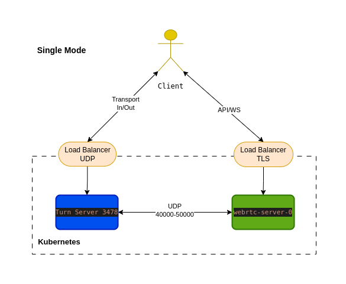
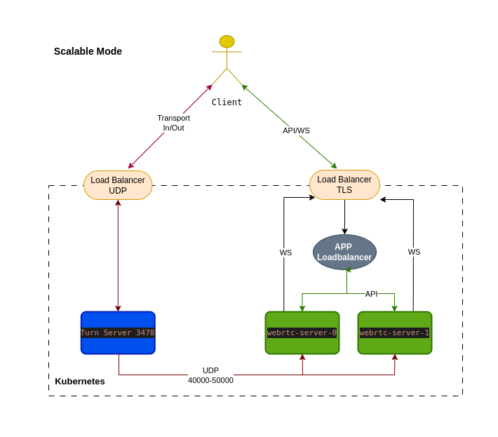

# 2060.io WebRTC Server

## Overview

This project is based on [Mediasoup-demo v3](https://github.com/versatica/mediasoup-demo/tree/v3) and has been customized for the 2060.io project. It supports deployment using Docker or Kubernetes, integrating [Coturn](https://github.com/coturn/coturn) for TURN functionality.

## Table of Contents

- [Overview](#overview)
- [Pre-requisites](#pre-requisites)
- [Solution Architectures](#solution-architectures)
- [Deployment Guide](#deployment-guide)
  - [Environment Variables](#environment-variables)
  - [Docker Deployment](#docker-deployment)
  - [Kubernetes Deployment](#kubernetes-deployment)
- [Configuration](#configuration)
  - [Configuring TCP Port](#configuring-tcp-port)
  - [ICE Server Configuration](#ice-server-configuration)
- [API Reference](#api-reference)
- [Protocol Documentation](#protocol-documentation)
- [WebRTC Client Setup](#webrtc-client-setup)

## Pre-requisites

- A Linux server with a public IP address (or an Elastic IP on AWS).
- Docker and Docker Compose for local deployments.
- A configured TURN server (e.g., Coturn) running on port `3478`.
- Mediasoup server running in a container with port `443` exposed.

## Solution Architectures

### 1️ Single Server Mode

- Runs One WebRTC server, Mediasoup, and TURN on a single instance.



#### **Advantages:**

- **Quick Deployment:** Easy to set up and deploy without complex dependencies.
- **Resource Efficiency:** Requires minimal infrastructure to operate effectively.
- **Lower Initial Costs:** Ideal for testing, development, or small-scale projects with controlled loads.

### 2 Scalable Deployment with Load Balancer App

- Uses Kubernetes to deploy multiple WebRTC server instances with load balancing.



#### **Advantages:**

- **Scalable, Resilient Architecture:** Ensures high availability and fault tolerance.
- **Load Balancing:** Distributes traffic efficiently among WebRTC servers.
- **Improved Performance:** Optimized for handling high traffic and multiple concurrent users.

## Deployment Guide

### Environment Variables

| Variable                 | Description                                                                                              | Default Value                       |
| ------------------------ | -------------------------------------------------------------------------------------------------------- | ----------------------------------- |
| `PROTOO_LISTEN_PORT`     | Port for the protoo WebSocket server and HTTP API server.                                                | `4443`                              |
| `HTTPS_CERT_FULLCHAIN`   | Path to the fullchain certificate file for HTTPS.                                                        | `<project_dir>/certs/fullchain.pem` |
| `HTTPS_CERT_PRIVKEY`     | Path to the private key file for HTTPS.                                                                  | `<project_dir>/certs/privkey.pem`   |
| `MEDIASOUP_INGRESS_HOST` | Ingress host for the mediasoup client.                                                                   |                                     |
| `MEDIASOUP_MIN_PORT`     | Minimum port for RTC connections in mediasoup.                                                           | `40000`                             |
| `MEDIASOUP_MAX_PORT`     | Maximum port for RTC connections in mediasoup.                                                           | `49999`                             |
| `MEDIASOUP_LISTEN_IP`    | The listening IP for audio/video in mediasoup.                                                           | `0.0.0.0` or `127.0.0.1`            |
| `MEDIASOUP_ANNOUNCED_IP` | Public IP address for audio/video in mediasoup..                                                         |                                     |
| `MEDIASOUP_INGRESS_HOST` | Set Ingress host for /rooms response                                                                     |                                     |
| `LOADBALANCER_URL`       | Specifies the URL of the load balancer responsible for distributing WebRTC rooms among available servers |                                     |
| `SERVICE_URL`            | Defines the base URL of the WebRTC server that registers itself with the load balancer                   |                                     |

To configure and build the `ICE Server`, you can use the following environment variables:

| Variable                           | Description                           | Default Value |
| ---------------------------------- | ------------------------------------- | ------------- |
| `MEDIASOUP_CLIENT_PROTOOPORT`      | Port used for the connection.         | `443`         |
| `MEDIASOUP_CLIENT_ICESERVER_PROTO` | Protocol configuration used (`udp`).  | `udp`         |
| `MEDIASOUP_CLIENT_ICESERVER_PORT`  | Port set in the TURN server.          | `3478`        |
| `MEDIASOUP_CLIENT_ICESERVER_USER`  | Username for the TURN server.         |               |
| `MEDIASOUP_CLIENT_ICESERVER_PASS`  | Password for the TURN server.         |               |
| `MEDIASOUP_CLIENT_ICESERVER_HOST`  | Public IP address of the TURN server. |               |

### Docker Deployment

```bash
git clone https://github.com/2060-io/webrtc-server.git
cd package/webrtc-server
docker build . -t 2060-webrtc-server:test
docker-compose up -d
```

### Kubernetes Deployment tips

Ensure that the Kubernetes load balancer allows UDP traffic to Coturn service nodes. Set the public IP in the `.env` file:

```sh
MEDIASOUP_CLIENT_ICESERVER_HOST=<Public_IP>
```

## Configuration

### Configuring TCP Port

Modify the `PROTOO_LISTEN_PORT` in `docker-compose.yml`:

```yaml
services:
  mediasoup:
    environment:
      PROTOO_LISTEN_PORT: 443
    ports:
      - '443:4443'
```

### ICE Server Configuration

```json
{
  "iceServers": [
    {
      "urls": "turn:your-turn-server.com:3478",
      "username": "user",
      "credential": "password",
      "credentialType": "password"
    }
  ]
}
```

## API Reference

Check out **Swagger API Documentation:** `https://yourserver-ip/API`

### Create Rooms

- **Method:** `POST`
- **Endpoint:** `/rooms/:roomId?`
- **Port:** `443`

**Request Body:**

```json
{
  "eventNotificationUri": "http://example.com/notification",
  "maxPeerCount": 50
}
```

**Response:**

```json
{
  "protocol": "2060-mediasoup-v1",
  "wsUrl": "wss://yourserver:443",
  "roomId": "12345abcde"
}
```

## Protocol Documentation

Refer to the [Mediasoup Server Protocol Guide](./docs/mediasoup-server-protocol.md) for details.

## WebRTC Client Setup

Check the [WebRTC Client Setup Guide](./docs/webrtc-client-setup-guide.md) for instructions.
